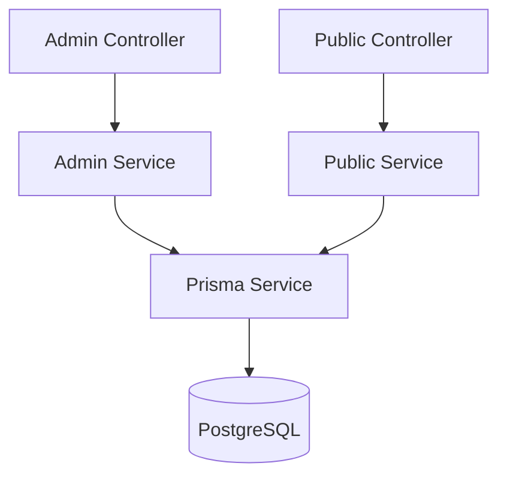

# News API - Backend com NestJS

Este é o backend de um sistema para gerenciamento e listagem de notícias, desenvolvido com **NestJS** e **TypeScript**, com persistência em **PostgreSQL** via **Prisma ORM**. O projeto foi estruturado para ser **escalável**, de **baixo acoplamento** e **fácil de manutenção e evolução**.

---

## Documentação Técnica

As decisões sobre arquitetura, organização do projeto e tecnologias utilizadas estão descritas em uma [ADR (Architecture Decision Record)](./docs/ADR/01-ADR-arquitetura.md) disponível no repositório.

---

## Funcionalidades

- Separação entre rotas **públicas** e **administrativas**
- Arquitetura **modular** por domínio
- Pronto para receber **autenticação** via middleware
- Boas práticas integradas (validação, testes, pipes)
- Persistência de dados com **PostgreSQL** e **Prisma**
- Ambiente padronizado com **Docker**

---

## Como rodar localmente

### Pré-requisitos

- [Docker](https://www.docker.com/)
- [Docker Compose](https://docs.docker.com/compose/)

---
### Passo a passo

#### 1. **Clone o repositório**

- via SSH
```bash 
git clone git@github.com:jessicacarolina/news-estadao-api.git
cd news-estadao-api
```
- Ou via HTTPS
```bash 
git clone https://github.com/jessicacarolina/news-estadao-api.git
cd news-estadao-api
```

#### 2. **Configure as variáveis de ambiente**

Renomeie o arquivo `.env.example` para `.env`:

```bash
cp .env.example .env
```

2.1. Preencha as variáveis de ambiente com os valores corretos.  
   Abaixo, uma breve explicação de cada uma:

| Variável           | Descrição                                                                 |
|--------------------|---------------------------------------------------------------------------|
| `DATABASE_URL`      | URL de conexão com o banco PostgreSQL usada pela aplicação                |
| `POSTGRES_USER`     | Usuário do banco de dados PostgreSQL (usado pelo container Docker)        |
| `POSTGRES_PASSWORD` | Senha do banco de dados PostgreSQL (usado pelo container Docker)          |
| `POSTGRES_DB`       | Nome do banco de dados PostgreSQL (usado pelo container Docker)           |

---

#### 3. **Suba os containers**

```bash
docker compose up --build
```

> Isso iniciará:
> - o backend NestJS (porta `3000`)
> - o banco PostgreSQL (porta `5432`)

Aguarde alguns segundos até o banco estar pronto.

---

#### 4. **Acesse o container do app**

```bash
docker exec -it app sh
```

Agora dentro do container, execute os próximos passos:

---

#### 5. **Aplique as migrations existentes**

```bash
npx prisma migrate dev
```

> Isso criará as tabelas no banco conforme o schema Prisma.

---

#### 6. **Rode o seed para popular o banco**

```bash
npx prisma db seed
```

> Isso vai inserir dados iniciais, como notícias de exemplo.

---

#### 7. **Acesse a aplicação**

- API pública: [http://localhost:3000/news](http://localhost:3000/news)

---

## Testes

A aplicação já está configurada com testes utilizando o framework de testes do próprio NestJS.

### Executar os testes

```bash
npm run test
```

Os testes automatizados cobrem os principais fluxos da aplicação. Abaixo está um resumo da cobertura nos módulos `news/admin` e `news/public`:

```
-------------------------------|---------|----------|---------|---------|-------------------
File                           | % Stmts | % Branch | % Funcs | % Lines | Uncovered Line #s 
-------------------------------|---------|----------|---------|---------|-------------------
src/module/news/admin          |   92.68 |      100 |     100 |   91.89 |                   
  admin.controller.ts          |     100 |      100 |     100 |     100 |                   
  admin.service.ts             |    87.5 |      100 |     100 |   86.36 | 19,37,55          
src/module/news/public         |   96.29 |      100 |     100 |   95.65 |                   
  public.controller.ts         |     100 |      100 |     100 |     100 |                   
  public.service.ts            |   94.11 |      100 |     100 |   93.33 | 61                  
-------------------------------|---------|----------|---------|---------|-------------------
```

> Testes executados com `npm run test:cov`. A cobertura será expandida conforme a aplicação evolui.

---

## Estrutura do Projeto

```bash
src/
├── modules/
│   └── news/
│       ├── admin/       # Rotas e serviços administrativos
│       ├── public/      # Rotas e serviços públicos
│       ├── dto/         # Data Transfer Objects
│       └── news.module.ts
├── shared/
│   └── prisma/          # Serviço centralizado de acesso ao banco
├── main.ts              # Ponto de entrada da aplicação
```

---

## Arquitetura



---

## Tecnologias Utilizadas

- [NestJS](https://nestjs.com/)
- [TypeScript](https://www.typescriptlang.org/)
- [Prisma ORM](https://www.prisma.io/)
- [PostgreSQL](https://www.postgresql.org/)
- [Docker](https://www.docker.com/)
- [Docker Compose](https://docs.docker.com/compose/)

---

#### Feito com ❤️ por [Jéssica Santos](https://github.com/jessicacarolina)
