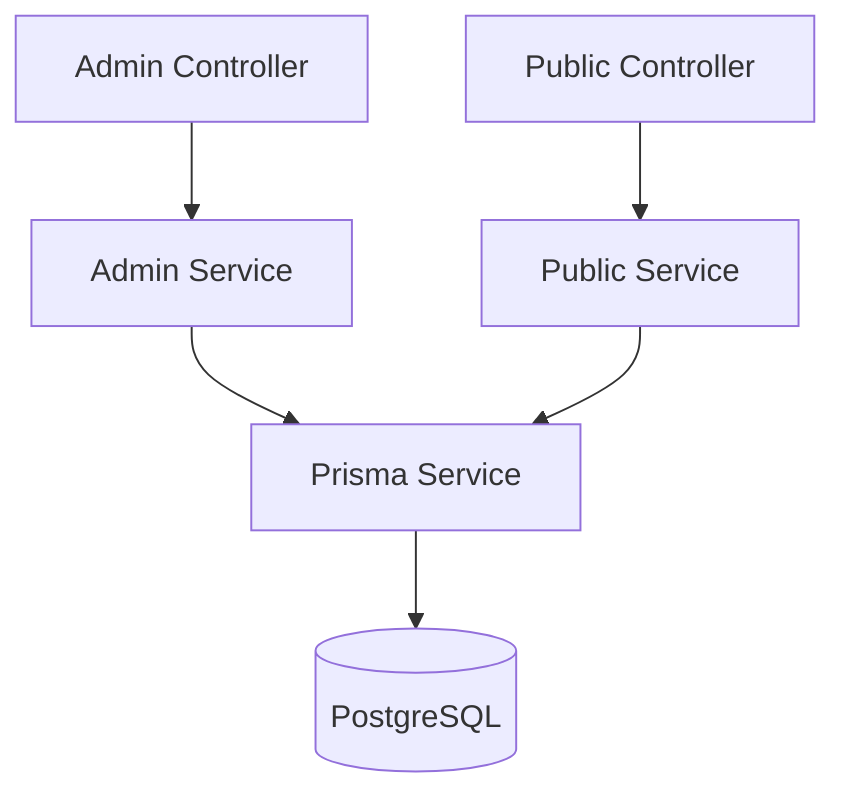

# **ADR 001: Arquitetura**

## *Contexto*  
Construir um backend escalável para um sistema de notícias com:  
- Separação clara entre rotas administrativas e públicas  
- Baixo acoplamento entre funcionalidades  
- Facilidade para adicionar autenticação no futuro via middleware  
- Facilidade de manutenção e evolução da aplicação  
- Persistência dos dados em um banco relacional confiável
---
## *Decisão pelo Banco de Dados NestJS com Typescript*
### Por que NestJS?
- Estrutura pronta para projetos em crescimento
- Arquitetura baseada em módulos, ideal para separação de domínios
- Boas práticas embutidas: testes, validação, interceptors, pipes
- Escalabilidade e um desenvolvimento consistente
---

## *Arquitetura Modular com Separação por Contexto*

Organiza os módulos por domínio (ex: `news`) e, dentro de cada um, por contexto de uso:

```bash
src/
├── modules/
│   └── news/
│       ├── admin/               # Funcionalidades restritas à administração
│       │   ├── controllers/     # Rotas protegidas para criar, editar, deletar notícias
│       │   ├── services/        # Lógica de negócios do admin
│       ├── public/              # Funcionalidades acessíveis ao público geral
│       │   ├── controllers/     # Listagem de todas as notícias e visualização individual
│       │   ├── services/        # Lógica de exibição pública
│       ├── dto/                 # Data Transfer Objects comuns
│       ├── entities/            # Definições das entidades de dados
│       └── news.module.ts       # Configuração do módulo de notícias
├── shared/                      # Componentes reutilizáveis (pipes, guards, etc.)
├── main.ts                      # Entry point da aplicação
```

### Diagrama da arquitetura



---

## *Decisão pelo Banco de Dados PostgreSQL com Prisma ORM*

### Por que PostgreSQL + Prisma?
- Prisma facilita o mapeamento objeto-relacional com TypeScript
- Migrações versionadas
- Autocompletar e modelo de dados fortemente tipado
- PostgreSQL é confiável, tem facilidade no uso, com ótima performance e suporte ativo da comunidade
---

### *Ambiente Contêinerizado com Docker*  
Utilizar **Docker** para padronizar o ambiente de desenvolvimento e facilitar a replicação em outros ambientes.

#### Justificativa: 
- Garante que o time utilize a mesma versão de Node, banco, e dependências  
- Facilita setup para novos desenvolvedores com `docker-compose up`  
- Permite testes locais com PostgreSQL real, sem necessidade de instalação local

#### Estrutura Inicial:
```bash
docker/
├── docker-compose.yml      # Orquestra containers de app, db, e prisma studio
├── Dockerfile              # Imagem para rodar app NestJS
└── .dockerignore
```

#### Serviços padrão:  
- **app**: Container rodando o backend NestJS  
- **db**: PostgreSQL com volume persistente  
- **studio**: Prisma Studio exposto localmente (opcional para debugging visual)

#### Exemplo de uso:
```bash
# Subir containers com ambiente completo
docker-compose up --build

# Acessar Prisma Studio
http://localhost:3333

# Executar comandos dentro do app
docker exec -it backend-container-name bash
```
